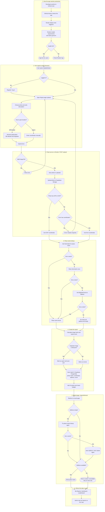

# MapMyWaste — Project Workflow

```mermaid
flowchart TD
    subgraph USER["1. User reports waste (browser)"]
        A([User opens MapMyWaste]) --> B{Logged in?}
        B -- No --> B1[Register / log in] --> C
        B -- Yes --> C[Open Report page /upload]
        C --> D[Choose photo and write description]
        D --> E{How to give location?}
        E -- GPS button --> E1[Browser geolocation<br/>fills latitude and longitude]
        E -- Type it --> E2[Enter coordinates manually]
        E1 --> F[Submit form]
        E2 --> F
    end

    subgraph SERVER["2. Flask server on Render: POST /upload"]
        F --> G{Valid image file?}
        G -- No --> G1[/Show error/] --> C
        G -- Yes --> H[Save photo in uploads/]
        H --> I[Upload photo to Supabase Storage]
        I --> J{Photo has GPS in EXIF?}
        J -- Yes --> J1[Use EXIF coordinates]
        J -- No --> K{Form has coordinates?}
        K -- No --> K1[/Error: location required/] --> C
        K -- Yes --> K2[Use form coordinates]
    end

    subgraph GEO["3. Place name lookup"]
        J1 --> L
        K2 --> L[Ask Nominatim for place name]
        L --> M{Got a name?}
        M -- No --> M1[Retry Nominatim once] --> N{Got a name?}
        N -- No --> N1[Ask BigDataCloud as fallback] --> O{Got a name?}
        M -- Yes --> P[Place name found]
        N -- Yes --> P
        O -- Yes --> P
        O -- No --> Q[No name yet<br/>address left empty]
    end

    subgraph SAVE["4. Create the report"]
        P --> R
        Q --> R[Calculate image hash and waste score]
        R --> S{Duplicate image<br/>or filename?}
        S -- Yes --> S1[Mark as spam and warn user]
        S -- No --> S2[Mark as normal]
        S1 --> T
        S2 --> T[(Save report in Supabase PostgreSQL<br/>photo name, coordinates, address, score)]
        T --> U[Add 10 points and check badges]
    end

    subgraph RESULT["5. Result page: /report/id/result"]
        U --> V[Redirect to result page]
        V --> W{Address empty?}
        W -- Yes --> W1[Try place name lookup again]
        W1 --> W2{Got a name?}
        W2 -- Yes --> W3[(Save address, never asked again)]
        W2 -- No --> X
        W -- No --> X
        W3 --> X{Address available?}
        X -- Yes --> X1([Show place name])
        X -- No --> X2([Show Location unavailable<br/>retry on next visit])
    end

    subgraph VIEW["6. Where the data is used"]
        X1 --> Y
        X2 --> Y[My Reports, Dashboard, Leaderboard]
        Y --> Z[Admin sees all reports on live map]
    end

    subgraph DEPLOY["7. How the app reaches production"]
        DEV[Developer pushes to GitHub main] --> CI[GitHub Actions checks the app]
        CI --> HOOK[Render deploy hook triggered]
        HOOK --> BUILD[Render installs requirements<br/>and starts gunicorn]
        BUILD --> HEALTH{/health OK?}
        HEALTH -- Yes --> LIVE([App live for users])
        HEALTH -- No --> FIX([Check Render logs])
    end

    LIVE -.-> A
```
